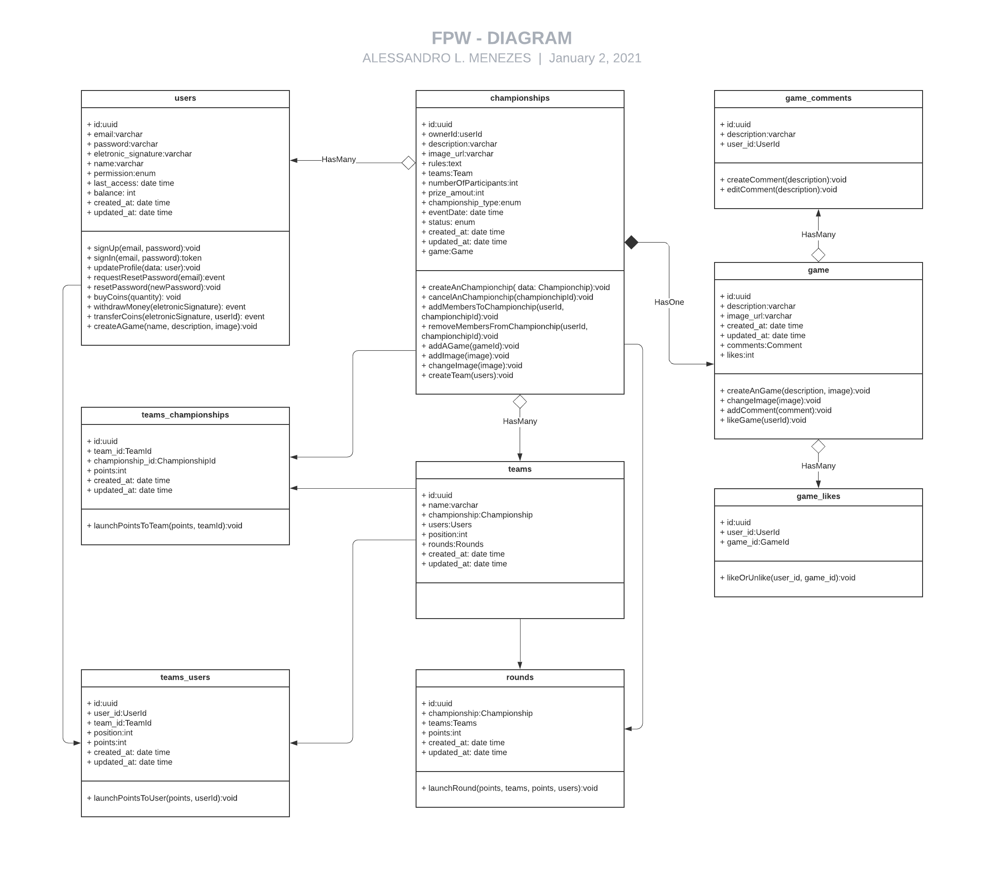
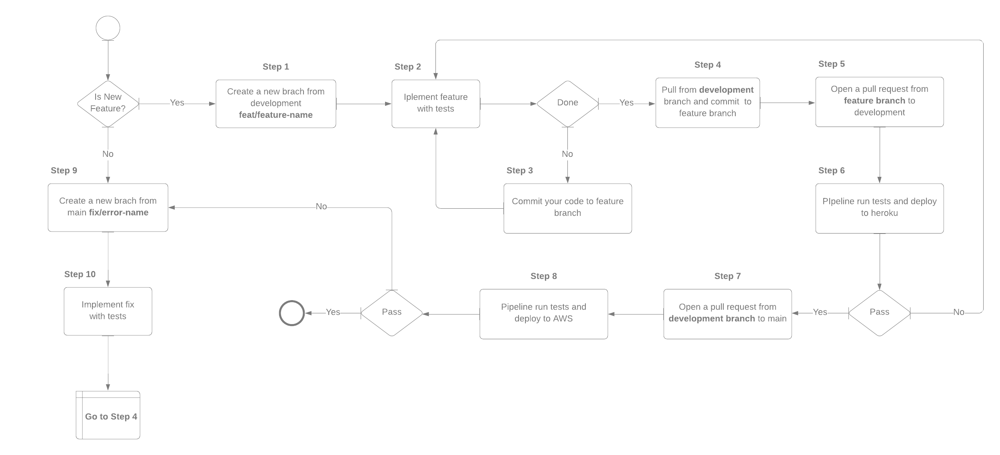

# Api

#### Como executar o projeto com Docker

- `$ yarn install`

- `$ yarn build`

- `$ docker-compose up -d`

#### Como executar o projeto localmente

- `Configure seu arquivo .env utilizando como modelo o .env.example`

- `$ yarn start:dev`

#### Documentação da api

[Link da Documentação da Api - Postman](https://documenter.getpostman.com/view/9702967/TVt2c3oT 'LInk da Documentação da Api - Postman')

#### Diagrama de classe

#### Api em ambiente de desenvolvimento

[Acessar Link](https://firstplayerwinner.herokuapp.com/)

`$ https://firstplayerwinner.herokuapp.com/`

#### Pipeline de desenvolvimento

[Acessar link](https://lucid.app/lucidchart/4807f9d0-42de-42f5-9f88-ba626f4a511e/view#)

